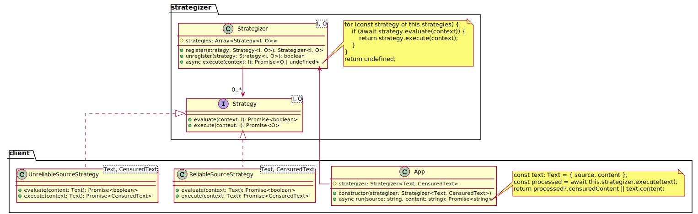

# The Strategizer Pattern

The strategizer pattern is a reusable extension of the classic [Strategy](https://en.wikipedia.org/wiki/Strategy_pattern) pattern.
It builds on the ideas of the `Strategy` pattern and provides abstractions for selecting the right strategy for a given context.
Practically speaking, it affords a dynamic if-else or switch-case logic where the branching logic can be added at runtime.

## Problem

Let's assume we have a text censuring app. The app receives a text as input and depending on the source of input, the app needs to
apply different algorithms to censure the text. Here is the code snippet for the app:

```typescript
type Source = 'textbook' | 'newspaper' | 'magazines' | 'socialmedia';

interface Text {
  content: string;
  source: Source;
}

interface SensoredText extends Text {
  sensored?: string;
}

class App {
  async run(source: string, content: string): Promise<string> {
    const text: Text = { source, content };

    if (source === `textbook`) {
      const censuredContent = '...'; // do some logic / api calls with text.content to generate sensored text
      return censuredContent;
    }
    if (source === 'newspaper') {
      // ...
    }
    // ... more conditional branches for other input sources
  }
}
```

There are some key design issues with this type of code, let's discuss them in terms of some key Object-Oriented design priciples:

1. **Single Responsibility Principle**: The class tries to handle many concerns in its `run` method and will need to change when any of those concerns need updates.
2. **Open Closed Principle**: The class will need to change everytime a new text source is added. The implemnation does not separate what changes from what remains the same.

## Solution

For brevity, let's assume that the `textbook` and `newspaper` are reliable sources and don't need the same type of censuring that `magazines` and `socialmedia` need. Here is a new design of the code:



In the diagram, the pattern library exposes the `strategizer` package which defines the `Strategy` interface that can be registered to a `Strategizer` object. The `Strategizer` object executes the first strategy that evaluates to `true` based on the implementation provided by the registered strategies.

On the client side, `ReliableSourceStrategy` and `UnreliableSourceStrategy` are registered to a `Strategizer` object and which is then passed to the client `App`. The client `App` then delegate the call to its `run` method to the `execute` method of the `Strategizer`. Depending on the type of input source in the context object, the first strategy that `evaluates` to `true` will process the input to perform censuring and return the value to the app. The full implementation is available in the [strategizer example](examples/strategizer) folder.

### Pros

1. The solution provides small strategy classes each with single responsibility to handle supported sources. This allows small testable classes making code maintainable.

2. The design affords supporting new sources by just registering new strategy objects.

### Cons

1. As with any cohesive design, the pattern tends to add several small classes in the codebase.

## Other Applications

The pattern can be used for creating simple factory to create new objects based on supplied context/input. Here is a smaple code snippet for the use case:

```typescript
// fruit-factory.ts
import { Factory } from
const fruitStrategizer = new Strategizer<string, Fruit>()
  .register({
    evaluate: async (type: string) => type === 'apple',
    execute: async (_) => new Apple()
  })
  .register({
    evaluate: async (type: string) => type === 'orange',
    execute: async (_) => new Orange()
  });

export default factory = new Factory(fruitStrategizer);


// client.ts
import factory from './fruit-factory.ts';

const apple = factory.create('apple'); // Creates an Apple
const orange = factory.create('orange'); // Creates an Orange
const fruit = factory.create('kiwi'); // Returns undefined
```
